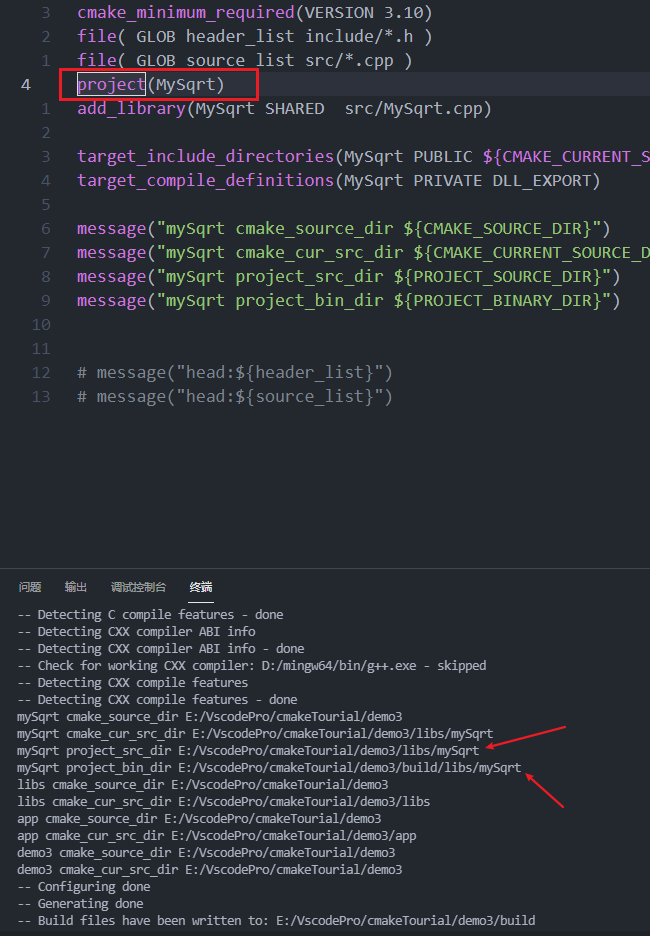

# Morden CMake学习笔记

| 变量                       | 意义                                                         |
| -------------------------- | ------------------------------------------------------------ |
| CMAKE_SOURCE_DIR           | 当前项目最顶层CMakeLists.txt的目录                           |
| CMAKE_CURRENT_SOURCE_DIR   | 当前项目CMakeLists.txt                                       |
| PROJECT_SOURCE_DIR         | 当前项目的源目录                                             |
| PROJECT_BINARY_DIR         | 当前项目的生成目录                                           |
| CMAKE_BINARY_DIR           | 根二进制文件/生成目录，运行 cmake 命令的目录。               |
| target_include_directories | 目标包含的路径  PUBLIC: 包含在此库中 也包含在链接此库的target中  (自生和其他) PRIVATE:该目录将添加到此目标的包含目录中（只是自身包含） INTERFACE:该目录将添加到链接此库的任何目标的包含目录中（只是其他包含，自身不包含） |
|

## 一、CMake构建的一般步骤
### 1. 步骤
    1. md build
    2. cd build
    // ..表示的是
    3. cmake -DCMAKE_BUILD_TYPE=Debug -G "MinGW Makefiles" .. 
    4. make
### 2. cmake 指令参数

~~~cmake
cmake --help 

# 指定C ++标准
set(CMAKE_CXX_STANDARD 11)
set(CMAKE_CXX_STANDARD_REQUIRED True)

# 设置编译器
cmake -DCMAKE_BUILD_TYPE=Debug -G "Visual Studio 16 2019".. 
cmake -DCMAKE_BUILD_TYPE=Debug -G "MinGW Makefiles" .. 

# 设置install目录
cmake -DCMAKE_INSTALL_PREFIX=d://cmakeInstall ..

# 设置默认的编译模式 如果没有指定的话
if(NOT CMAKE_BUILD_TYPE AND NOT CMAKE_CONFIGURATION_TYPES)
  message("Setting build type to 'RelWithDebInfo' as none was specified.")
  set(CMAKE_BUILD_TYPE RelWithDebInfo CACHE STRING "Choose the type of build." FORCE)
  # 设置可能构建的类型
  set_property(CACHE CMAKE_BUILD_TYPE PROPERTY STRINGS "Debug" "Release"
    "MinSizeRel" "RelWithDebInfo")
endif()
~~~

## 二、生成可执行文件 demo1
### 1. 文件目录
    demo1
       CMakeLists.txt
       main.cpp      
### 2. CMakeLists文件

~~~cmake
#设置 camke最小支持的版本
cmake_minimum_required(VERSION 3.10)
#设置工程名字
project(CaculateSqrt)
# 增加了一个可执行的target
add_executable(CaculateSqrt main.cpp)
~~~

## 三、加版本信息 demo2
### 1. 文件目录
    E:.
    │   CMakeLists.txt
    │   main.cpp
    │   TutorialConfig.h.in
    │
    └───build 

当 CMake 配置此头文件时，会在二进制目录下生成一个文件 TutorialConfig.h，会把 TutorialConfig.h.in 中的内容拷贝到里面，只是把 @Tutorial_VERSION_MAJOR@ 和 @Tutorial_VERSION_MINOR@ 替换成在 CMakeLists.txt 的配置的 1 和 0。
CMake 会把版本信息存储在以下变量中：

- PROJECT_VERSION，             PROJECT-NAME_VERSION
- PROJECT_VERSION_MAJOR,  PROJECT-NAME_VERSION_MAJOR
- PROJECT_VERSION_MINOR,  PROJECT-NAME_VERSION_MINOR
- PROJECT_VERSION_PATCH,  PROJECT-NAME_VERSION_PATCH
- PROJECT_VERSION_TWEAK,  PROJECT-NAME_VERSION_TWEAK.

MAJOR、MINOR、PATCH、TWEAK 分别代表着版本号的四位，比如版本号 1.2.3.4，MAJOR=1、MINOR=2、PATCH=3、TWEAK=4。版本号不一定非得是4位，可以只有1位，只是最大为4位。

### 2.cmake 文件
~~~cmake

cmake_minimum_required(VERSION 3.10) 

# 设定工程名和版本号 
project(Tutorial  VERSION 2.2)
# configure_file的作用将一份文件拷贝到另一个位置并修改它的内容，使得在代码中使用CMake中定义的变量 
# configure_file官方文档：https://cmake.org/cmake/help/latest/command/configure_file.html 

# TutorialConfig.h 生成在二进制文件的地方
configure_file(TutorialConfig.h.in TutorialConfig.h)

# specify the C++ standard 
set(CMAKE_CXX_STANDARD 11) 
set(CMAKE_CXX_STANDARD_REQUIRED True) 

# add the executable 
add_executable(Tutorial  main.cpp) 

# 指定项目编译的时候需要include的文件路径，PROJECT_BINARY_DIR变量为编译发生的目录
#PRIVATE：仅作为本目标的包含目录；
#INTERFACE：其他目标链接到本目标时作为其他目标的包含目录；
#PUBLIC：既作为本目标的包含目录，又作为连接到本目标的其他目标的包含目录。对于PUBLIC标头来说，最好令其拥有命名空间以避免命名冲突

# target_include_directories官方文档：https://cmake.org/cmake/help/v3.3/command/target_include_directories.html 

target_include_directories(Tutorial  PUBLIC 
                           "${PROJECT_BINARY_DIR}" 
                           ) 
~~~

## 四、生成dll并引用 demo3

### 1. 目录结构

### 2.cmake 文件
- mySqrt的cmake
~~~cmake

cmake_minimum_required(VERSION 3.10)

# not recommanded
file( GLOB header_list include/*.h )
file( GLOB source_list src/*.cpp )

# project(MySqrt)
add_library(MySqrt SHARED  src/MySqrt.cpp)

# 指的是 demo3/libs的文件夹
# public    -表示包含在此库中 也包含在链接此库的target中
# PRIVATE   -该目录将添加到此目标的包含目录中
# INTERFACE -该目录将添加到链接此库的任何目标的包含目录中。
target_include_directories(MySqrt PUBLIC ${PROJECT_SOURCE_DIR}/libs)

# 编译的时候的定义 DLL_EXPORT 只给自己使用 private
target_compile_definitions(MySqrt PRIVATE DLL_EXPORT)

# 打印输出
message("mySqrt cmake_source_dir ${CMAKE_SOURCE_DIR}")
message("mySqrt cmake_cur_src_dir ${CMAKE_CURRENT_SOURCE_DIR}")
message("mySqrt project_src_dir ${PROJECT_SOURCE_DIR}")
message("mySqrt project_bin_dir ${PROJECT_BINARY_DIR}")
~~~

